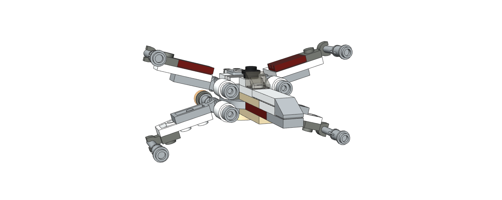

<h1 align="center">Welcome to Lego Expo 👋</h1>

<p align="center">
  <a aria-label="made with expo" href="https://github.com/expo">
    
  </a>
  <a href="https://twitter.com/baconbrix">
    
  </a>
  <a href="https://github.com/evanbacon" aria-label="Follow EvanBacon on Github">
    
  </a>

  <a href="https://blog.expo.io/@Baconbrix" aria-label="Follow Baconbrix on Medium">
    
  </a>
  
  <a href="/LICENSE">
    
  </a>
  

</p>



> Play with Lego bricks anywhere with Expo!

### 🏠 [**Try it now!**](https://ldr.netlify.com)

## Setup

```sh
npm install
```

## Usage

```sh
expo start --web
```

## Author

👤 **Evan Bacon**

- Twitter: [@baconbrix](https://twitter.com/baconbrix)
- Github: [@EvanBacon](https://github.com/EvanBacon)

## 🤝 Contributing

Contributions, issues and feature requests are welcome!<br />Feel free to check [issues page](https://github.com/EvanBacon/Lego-Expo/issues).

## Show your support

Give a ⭐️ if this project helped you!

## 📝 License

Copyright © 2019 [Evan Bacon](https://github.com/EvanBacon).<br />
This project is [MIT](https://github.com/EvanBacon/Lego-Expo/blob/master/LICENSE) licensed.
